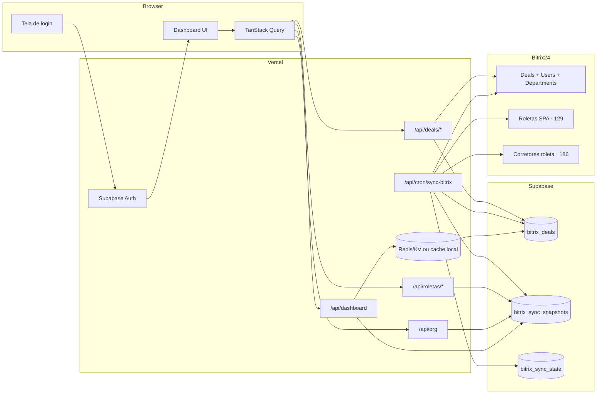

# Dashboard Superintendência Stüpp

Painel operacional para acompanhar negociações, esteiras comerciais e **roletas de distribuição** do **Bitrix24** da Superintendência Stüpp — com KPIs, funis, kanban e filtros organizacionais. O dashboard consulta um espelho operacional no **Supabase**; o Bitrix permanece como origem e destino das movimentações.

| | |
|---|---|
| **Produção** | [dashboard-st-pp.vercel.app](https://dashboard-st-pp.vercel.app) |
| **Repositório** | [RafaelADSdev/Dashboard-St-pp](https://github.com/RafaelADSdev/Dashboard-St-pp) |
| **Stack** | Next.js 16 · React 19 · Tailwind v4 · Supabase Auth/Postgres · Bitrix24 REST · Vercel |

---

## Início rápido

```bash
git clone https://github.com/RafaelADSdev/Dashboard-St-pp.git
cd Dashboard-St-pp
npm install
cp .env.example .env.local   # preencha o webhook Bitrix e o Supabase
npm run dev
```

Acesse [http://localhost:3000](http://localhost:3000). Para criar o primeiro usuário admin:

```bash
npm run seed:admin
```

Requer `SUPABASE_SERVICE_ROLE_KEY` e `SEED_ADMIN_PASSWORD` no `.env.local` (ou passe a senha como argumento). O script cria o usuário `admin`; **troque a senha imediatamente** no painel Supabase (Auth → Users). Não registre senhas neste repositório e não execute o seed contra produção sem revisar `scripts/seed-admin.mjs`.

```bash
# Exemplo (PowerShell)
$env:SEED_ADMIN_PASSWORD = "senha-forte-local"
npm run seed:admin
```

---

## Sumário

- [Páginas do painel](#páginas-do-painel)
- [Funcionalidades](#funcionalidades)
- [Integração Bitrix24](#integração-bitrix24)
- [Stack tecnológica](#stack-tecnológica)
- [Arquitetura](#arquitetura)
- [Estrutura do projeto](#estrutura-do-projeto)
- [Configuração local](#configuração-local)
- [Deploy na Vercel](#deploy-na-vercel)
- [API interna](#api-interna)
- [Filtros](#filtros)
- [Exportação](#exportação-de-relatórios)
- [Kanban operacional](#kanban-operacional)
- [Performance e confiabilidade](#performance-e-confiabilidade)
- [Segurança](#segurança)
- [Solução de problemas](#solução-de-problemas)
- [Scripts](#scripts-disponíveis)

---

## Páginas do painel

| Rota | Descrição |
|------|-----------|
| `/` | Visão geral — KPIs das duas esteiras, funis, evolução, leads por diretoria/fonte |
| `/esteira-geral` | Comercial Geral (category `16`) + kanban operacional |
| `/esteira-economico` | Comercial Econômico (category `64`) + kanban operacional |
| `/roletas` | Catálogo de roletas Stüpp, KPIs por status e gestão de corretores |

Todas as páginas do painel exigem login (Supabase Auth). O acesso ao Bitrix é feito pelo servidor via webhook — o usuário do dashboard **não** precisa de credenciais Bitrix.

---

## Funcionalidades

### Dashboard e análises

- KPIs consolidados das esteiras Comercial Geral e Comercial Econômico
- Funis comerciais, evolução temporal e distribuição por diretoria, equipe e fonte (`SOURCE_ID`)
- Gráficos interativos com suporte a modo claro/escuro
- Atualização automática da interface a cada **5 minutos**, lendo o Supabase

### Kanban operacional (esteiras)

Disponível em `/esteira-geral` e `/esteira-economico`:

- Colunas alinhadas às fases do funil Bitrix
- Arrastar e soltar para mudar fase (`crm.deal.update`)
- Modal com detalhes do lead, transferência individual e em lote
- Datas de chegada e última movimentação por esteira (campos Bitrix específicos)

### Roletas (`/roletas`)

Gestão e visão do catálogo de roletas Stüpp (SPA Bitrix, entity **129**):

- KPIs: roletas ativas, novas, suspensas e leads no período
- Filtros do catálogo com modo **rascunho → Aplicar filtros**:
  - Busca por corretor Stüpp
  - Diretoria e liderança (via corretores cadastrados na roleta)
  - Nome da roleta e status (ativa / nova / suspensa)
- Lista expandível por roleta com:
  - Alteração de status no kanban Bitrix
  - Corretores agrupados por liderança
  - Adicionar e remover corretores (entity **186** — aba “Corretores da roleta”)

### Filtros gerais (drawer lateral)

Presentes em todas as páginas principais:

| Filtro | Comportamento |
|--------|---------------|
| Período | Intervalo customizável (padrão: últimos 7 dias) |
| Esteira | Todas, Comercial Geral ou Comercial Econômico |
| Diretoria / Equipe / Corretor | Recorte pela estrutura org da Stüpp |
| Roleta | **Somente roletas ativas** (status `ativa` no kanban) |

Fluxo: ajuste os campos → **Aplicar filtros** → dados recarregam com feedback visual. Use **Limpar filtros** para voltar ao padrão.

### Exportação

Botão **Exportar** no header — PDF ou Excel com os filtros aplicados na página atual:

- Excel estruturado (Resumo, Detalhamento lead a lead, Evolução, abas por seção)
- PDF tabular por seções
- Leads ordenados pelos mais parados primeiro
- Identidade visual HubON

### Interface

- Modo claro/escuro (preferência salva no navegador)
- Sidebar recolhível com marcas Stüpp | HubON
- Painel de filtros em drawer lateral
- Tipografia Plus Jakarta Sans, paleta azul institucional

---

## Integração Bitrix24

### Esteiras comerciais (deals)

| Esteira | Category ID | Variável de ambiente |
|---------|-------------|----------------------|
| Comercial Geral | `16` | `NEXT_PUBLIC_BITRIX_ESTEIRA_GERAL_ID` |
| Comercial Econômico | `64` | `NEXT_PUBLIC_BITRIX_ESTEIRA_ECONOMICO_ID` |

### Roletas (SPA)

| Recurso | Entity / ID | Detalhe |
|---------|-------------|---------|
| Roletas | Entity **129**, category **20** | Kanban: Nova → Ativa → Suspensa |
| Corretores da roleta | Entity **186** | Vinculados pelo nome da roleta (`ufCrm11_1738081783`) |
| Campo roleta no deal | `UF_CRM_1734703374` | Usado nos filtros e cards do kanban |

Status operacionais: `ativa`, `nova`, `suspensa` — classificados a partir do estágio do kanban Bitrix.

### Estrutura organizacional

```
SUPERINTENDÊNCIA STÜPP (ID 3)
└── COMERCIAL-S (ID 60)
    ├── SANTOS · MONTEIRO · GEORGII · TALMON
    ├── STÜPP · HENRIQUE · SEVERO
    └── Equipes e sub-equipes (Líderes / LT)
```

Filtros de diretoria, equipe e corretor mapeiam `ASSIGNED_BY_ID` dos deals à árvore de departamentos.

### Webhooks

O token do Bitrix **nunca** vai para o navegador. A leitura do dashboard passa pelas API Routes do Next.js e pelo Supabase. O webhook é usado no servidor pela sincronização e pelas ações de escrita, como mover fase ou transferir corretor.

| Variável | Uso |
|----------|-----|
| `BITRIX_WEBHOOK_URL` | Webhook principal (obrigatório) |
| `BITRIX_WEBHOOK_URL_META` | Org, roletas, metadados (opcional — reduz carga) |
| `BITRIX_WEBHOOK_URL_DEALS` | Listagem e mutação de deals (opcional) |
| `BITRIX_PAUSED=true` | Pausa todas as chamadas ao Bitrix (manutenção) |

> Recomendado: criar webhooks extras no Bitrix (Aplicativos → Webhooks de entrada) com permissão CRM para distribuir carga e evitar `operation time limit`.

---

## Stack tecnológica

| Camada | Tecnologia |
|--------|------------|
| Framework | [Next.js 16](https://nextjs.org/) (App Router + Turbopack) |
| UI | [React 19](https://react.dev/) + [Tailwind CSS v4](https://tailwindcss.com/) + [next-themes](https://github.com/pacocoursey/next-themes) |
| Estado | [Zustand](https://zustand.docs.pmnd.rs/) |
| Dados | [TanStack Query v5](https://tanstack.com/query) |
| Kanban | [@dnd-kit](https://dndkit.com/) |
| Auth | [Supabase Auth](https://supabase.com/docs/guides/auth) + `@supabase/ssr` |
| Banco operacional | [Supabase Postgres](https://supabase.com/docs/guides/database) via `@supabase/supabase-js` |
| Cache distribuído | Upstash Redis/KV (opcional, com fallback local) |
| Gráficos | [Recharts](https://recharts.org/) + [ApexCharts](https://apexcharts.com/) |
| Exportação | jsPDF, jspdf-autotable, xlsx-js-style |
| Deploy | [Vercel](https://vercel.com/) |
| CRM | [Bitrix24 REST API](https://apidocs.bitrix24.com/) |

---

## Arquitetura



### Fluxo de dados

1. Login via Supabase Auth; o middleware protege páginas e APIs de usuário.
2. Um agendador autorizado chama `/api/cron/sync-bitrix` para ler Bitrix e atualizar o Supabase.
3. O cliente envia os filtros atuais para `/api/dashboard` ou `/api/roletas/stats`.
4. O servidor valida a cobertura histórica, filtra `bitrix_deals` no Supabase e agrega o resultado.
5. Movimentações continuam sendo enviadas ao Bitrix e, após sucesso, atualizam o espelho no Supabase.

O navegador não consulta o Postgres diretamente para dados operacionais. A `service_role` fica restrita às rotas server-side.

---

## Estrutura do projeto

```
src/
├── app/
│   ├── api/
│   │   ├── bitrix/[...path]/     # Proxy seguro ao webhook
│   │   ├── cron/sync-bitrix/     # Backfill e atualização incremental
│   │   ├── dashboard/            # Dados agregados do painel
│   │   ├── deals/                # Mover fase e transferir corretor
│   │   ├── org/                  # Estrutura organizacional
│   │   └── roletas/              # Catálogo, stats, status e corretores
│   ├── (protected)/roletas/      # Página de roletas
│   ├── esteira-geral/
│   └── esteira-economico/
├── api/                          # Clientes Bitrix (deals, roletas, org)
├── components/
│   ├── charts/                   # Funis, evolução, diretoria, origem
│   ├── filters/                  # Filtros gerais + RoletaFilter (só ativas)
│   ├── kanban/                   # LeadsKanbanBoard
│   ├── roletas/                  # Lista, gestão, filtros do catálogo
│   └── layout/                   # Sidebar, Header, ExportButton
├── hooks/                        # useLeadsData, useRoletasData, useStuppOrg...
├── lib/
│   ├── roletaStatus.ts           # Classificação ativa/nova/suspensa
│   ├── bitrixDealDates.ts        # Datas do kanban por esteira
│   └── server/                   # Consultas Supabase, sync, cache e webhooks
├── screens/                      # DashboardPage, Esteira*, RoletasPage
├── store/                        # filterStore (rascunho vs aplicado)
└── utils/                        # Agregação, exportação, filtros de roletas
lib/supabase/                     # Clientes browser/server + middleware
scripts/seed-admin.mjs            # Bootstrap do admin (somente dev; ver Segurança)
supabase/migrations/              # Auth e espelho operacional Bitrix
vercel-cli/                       # Scripts de configuração do deploy
```

---

## Configuração local

### Pré-requisitos

- **Node.js** 20+
- **npm** 9+
- Webhook Bitrix24 com permissões CRM:
  - `crm.deal.list`, `crm.deal.update`, `crm.status.list`
  - `crm.dealcategory.stage.list`, `crm.item.list`, `crm.item.add`, `crm.item.update`, `crm.item.delete`
  - `department.get`, `user.get`
- Projeto Supabase com Auth habilitado

### Variáveis de ambiente

Copie `.env.example` para `.env.local`:

```env
# Obrigatório — webhook Bitrix (somente servidor)
BITRIX_WEBHOOK_URL=https://seu-portal.bitrix24.com.br/rest/USER_ID/TOKEN/

# Opcional — distribui carga entre webhooks
BITRIX_WEBHOOK_URL_META=https://seu-portal.bitrix24.com.br/rest/1/XXXX/
BITRIX_WEBHOOK_URL_DEALS=https://seu-portal.bitrix24.com.br/rest/2/YYYY/

# Pausar integração (manutenção)
# BITRIX_PAUSED=true

# Esteiras
NEXT_PUBLIC_BITRIX_ESTEIRA_GERAL_ID=16
NEXT_PUBLIC_BITRIX_ESTEIRA_ECONOMICO_ID=64
NEXT_PUBLIC_BITRIX_ROLETA_CATEGORY_ID=20

# Supabase Auth + banco operacional
NEXT_PUBLIC_SUPABASE_URL=https://seu-projeto.supabase.co
NEXT_PUBLIC_SUPABASE_PUBLISHABLE_KEY=sua_chave_publishable
# Compatibilidade: NEXT_PUBLIC_SUPABASE_ANON_KEY=sua_chave_anon

# Apenas servidor — nunca expor no client
SUPABASE_SERVICE_ROLE_KEY=sua_service_role_key

# Sincronização Bitrix → Supabase
CRON_SECRET=gere_um_segredo_longo_e_aleatorio
BITRIX_SYNC_START_DATE=2026-06-01
BITRIX_SYNC_OVERLAP_MINUTES=60
```

**Autenticação:** login com **nome de usuário** (convertido internamente para `usuario@stupp.dashboard`). Aplique as migrations em `supabase/migrations/` antes do primeiro acesso.

**Compatibilidade legada:** também aceita `VITE_BITRIX_WEBHOOK_URL` e `VITE_BITRIX_ESTEIRA_*`.

### Comandos

```bash
npm run dev        # Desenvolvimento — http://localhost:3000
npm run build      # Build de produção
npm start          # Servidor de produção
npm run typecheck  # Verificação TypeScript
npm run seed:admin # Bootstrap do admin (dev; troque a senha após criar)
npm run check:supabase # Valida URL e chaves do Supabase
```

---

## Sincronização Bitrix → Supabase

O dashboard lê os dados operacionais somente do Supabase. A rota
`GET /api/cron/sync-bitrix` usa `Authorization: Bearer CRON_SECRET` para atualizar
o espelho a partir do Bitrix.

O `vercel.json` está compatível com o plano Hobby e executa o cron uma vez por dia,
às `05:00 UTC` (`02:00` no horário de Brasília). Para atualização a cada 5 minutos,
use um agendador externo chamando a mesma rota ou altere o projeto para um plano
Vercel que aceite `*/5 * * * *`.

### Atualização pelo botão

O botão **Atualizar** tem dois comportamentos:

- Administrador: chama `POST /api/admin/sync-bitrix`, executa a sincronização
  incremental Bitrix → Supabase e recarrega todas as consultas ativas.
- Demais usuários: recarrega os dados existentes no Supabase, sem chamar o Bitrix.

Enquanto houver uma aba administradora aberta, o dashboard executa automaticamente
a mesma atualização a cada **5 minutos**. A aba precisa estar visível; se o navegador
for fechado ou o computador entrar em suspensão, a sincronização volta a ser tentada
quando o painel ficar visível novamente. Um marcador compartilhado no
`localStorage` reduz chamadas duplicadas entre abas, e o lock no Supabase continua
sendo a proteção final contra sincronizações concorrentes.

A rota administrativa valida novamente a sessão e a função de sincronização usa
um lock no Supabase. Cliques concorrentes não iniciam duas cargas. Ao concluir, a
versão do cache passa a usar o novo `completed_at`, evitando exibir uma resposta
anterior à sincronização.

### Agendamento sem Vercel Pro com Supabase Cron

Sem Vercel Pro, o próprio Supabase pode chamar a rota protegida a cada 5 minutos,
dentro dos limites do plano do projeto:

1. Em **Supabase → Vault**, crie `dashboard_sync_url` com a URL completa da rota
   `/api/cron/sync-bitrix` e `dashboard_sync_cron_secret` com o mesmo valor de
   `CRON_SECRET` configurado na Vercel.
2. Ative os módulos `pg_cron` e `pg_net` em **Integrations**.
3. Execute no SQL Editor:

```sql
select cron.schedule(
  'sync-bitrix-every-5-minutes',
  '*/5 * * * *',
  $$
  select net.http_get(
    url := (
      select decrypted_secret
      from vault.decrypted_secrets
      where name = 'dashboard_sync_url'
    ),
    headers := jsonb_build_object(
      'Authorization',
      'Bearer ' || (
        select decrypted_secret
        from vault.decrypted_secrets
        where name = 'dashboard_sync_cron_secret'
      )
    ),
    timeout_milliseconds := 300000
  );
  $$
);
```

As execuções ficam registradas em `cron.job_run_details`; respostas HTTP recentes
podem ser conferidas em `net._http_response`.

1. Aplique as migrations de `supabase/migrations/` no projeto Supabase.
2. Configure `SUPABASE_SERVICE_ROLE_KEY`, `CRON_SECRET` e `BITRIX_SYNC_START_DATE`.
3. Faça o deploy. Para iniciar a sincronização manualmente sem esperar o cron:

```bash
curl -H "Authorization: Bearer SEU_CRON_SECRET" \
  "https://seu-dominio/api/cron/sync-bitrix"
```

A sincronização mantém os dados recentes atualizados e faz o histórico desde
`BITRIX_SYNC_START_DATE` em janelas de até sete dias. O cursor fica salvo em
`bitrix_sync_state.details`, então cada execução continua do ponto
anterior sem repetir toda a carga. A cobertura exibida ao dashboard só muda para
a data inicial quando não houver lacunas no período. Use `?full=1` apenas para
reiniciar o cursor do backfill.

Para conferir novamente um intervalo histórico depois de mudanças de responsável
ou da estrutura organizacional, use a reconciliação protegida:

```bash
curl -H "Authorization: Bearer SEU_CRON_SECRET" \
  "https://seu-dominio/api/cron/sync-bitrix?from=2026-06-07&to=2026-06-13"
```

Ela relê o período no Bitrix, mantém somente responsáveis das diretorias Stüpp
nomeadas e atualiza apenas o espelho do Supabase. Negócios classificados como
`Outros` não entram no dashboard.

Os filtros enviados pelo front continuam iguais; `/api/dashboard` os aplica nas
consultas ao Supabase e mantém o mesmo contrato JSON usado pela interface.

Tabelas do espelho:

| Tabela | Responsabilidade |
|--------|------------------|
| `bitrix_deals` | Negócios das esteiras Geral e Econômico usados pelo dashboard |
| `bitrix_sync_snapshots` | Organização, fases, fontes, roletas e vínculos |
| `bitrix_sync_state` | Lock, cursor, cobertura histórica e último erro |

## Deploy na Vercel

O projeto esperado é `auzendegbrs-projects/dashboard-st-pp`. Conecte o repositório
`RafaelADSdev/Dashboard-St-pp` e configure as variáveis nos ambientes Production,
Preview e Development:

| Variável | Obrigatória | Sensível |
|----------|-------------|----------|
| `BITRIX_WEBHOOK_URL` | Sim | Sim |
| `BITRIX_WEBHOOK_URL_META` | Não | Sim |
| `BITRIX_WEBHOOK_URL_DEALS` | Não | Sim |
| `NEXT_PUBLIC_BITRIX_ESTEIRA_GERAL_ID` | Sim | Não |
| `NEXT_PUBLIC_BITRIX_ESTEIRA_ECONOMICO_ID` | Sim | Não |
| `NEXT_PUBLIC_BITRIX_ROLETA_CATEGORY_ID` | Sim | Não |
| `NEXT_PUBLIC_SUPABASE_URL` | Sim | Não |
| `NEXT_PUBLIC_SUPABASE_PUBLISHABLE_KEY` ou `NEXT_PUBLIC_SUPABASE_ANON_KEY` | Sim | Não |
| `SUPABASE_SERVICE_ROLE_KEY` | Sim | Sim |
| `CRON_SECRET` | Sim | Sim |
| `BITRIX_SYNC_START_DATE` | Sim (`2026-06-01`) | Não |
| `BITRIX_SYNC_OVERLAP_MINUTES` | Não (`60`) | Não |
| `KV_REST_API_URL` + `KV_REST_API_TOKEN` ou equivalentes Upstash | Não | Sim |

O script assistido configura Supabase, sincronização, `.env.local` e redeploy:

```powershell
.\vercel-cli\setup-supabase-sync.ps1 `
  -ServiceRoleKey "sua_service_role" `
  -CronSecret "seu_cron_secret" `
  -SupabasePublishableKey "sua_chave_publishable" `
  -SyncStartDate "2026-06-01"
```

Consulte [vercel-cli/README.md](vercel-cli/README.md) para PowerShell, Linux e
macOS. O deploy também pode ser disparado manualmente:

```bash
npx vercel --prod
```

---

## API interna

As rotas do painel exigem sessão Supabase válida. A rota de cron não usa sessão
de usuário; ela exige o `CRON_SECRET` no cabeçalho `Authorization`.

### `POST /api/admin/sync-bitrix`

Executa uma sincronização incremental e recarrega o espelho operacional. Exige
sessão de administrador e aceita somente requisições da mesma origem.

### `GET /api/org`

Estrutura organizacional (diretorias, equipes, corretores). Cache: **24 h**.

### `GET /api/roletas`

Catálogo completo de roletas Stüpp com corretores e vínculos org. Cache: **24 h**.

### `GET /api/roletas/stats`

Estatísticas de leads por roleta no período. Parâmetros: `dateFrom`, `dateTo`, `diretoria`, `equipe`, `corretor`.

### `POST /api/roletas/[id]/status`

Altera status da roleta no kanban Bitrix.

```json
{ "status": "ativa" }
```

Valores: `ativa`, `nova`, `suspensa`.

### `POST /api/roletas/[id]/corretores`

Adiciona corretor à roleta.

```json
{ "corretorUserId": "123", "corretorName": "Nome", "roletaTitle": "Roleta X" }
```

### `DELETE /api/roletas/[id]/corretores`

Remove corretor. Query: `?recordId=456`.

### `GET /api/dashboard`

Dados agregados do painel.

| Parâmetro | Descrição |
|-----------|-----------|
| `dateFrom`, `dateTo` | `YYYY-MM-DD` (obrigatórios) |
| `esteira` | `TODAS` \| `GERAL` \| `ECONOMICO` |
| `diretoria`, `equipe`, `corretor`, `roleta` | IDs (vazio = todos) |

Resposta inclui KPIs, `byDiretoria`, `byTeam`, `byStage`, `bySource`, funis, `overTime`, `kanbanBoards`, `leadDetails`. Cache: **10 s** por combinação de filtros.

### `POST /api/deals/stage`

```json
{ "dealId": "123", "stageId": "C16:NEW" }
```

### `POST /api/deals/assign`

```json
{ "dealId": "123", "assignedById": "456" }
```

### `POST /api/deals/assign/batch`

```json
{ "dealIds": ["123", "456"], "assignedById": "789" }
```

---

## Exportação de relatórios

| Formato | Conteúdo |
|---------|----------|
| **Excel** | Resumo + Detalhamento (lead a lead) + Evolução + seções com ranking e `%` |
| **PDF** | Relatório tabular por seções com filtros no topo |

Cada lead exportado inclui tempo na esteira, última atualização e tempo sem atualizar. Linhas com valor `0` são omitidas nas seções agregadas.

---

## Kanban operacional

| Ação | Como usar |
|------|-----------|
| Ver detalhes | Clique no card |
| Mudar fase | Arraste para outra coluna |
| Transferir um lead | Modal → escolher corretor |
| Transferir em lote | Selecionar em lote → marcar cards → Transferir |

### Datas nos cards

| Esteira | Chegou ao corretor | Última movimentação |
|---------|-------------------|---------------------|
| **Econômico** | `DATE_CREATE` | `DATE_MODIFY` + modificado por |
| **Geral** | `UF_CRM_1738332137` ou Data de Entrada | Maior data entre fases `UF_CRM_173833*` ou `MOVED_TIME` |

Detalhes em `src/lib/bitrixDealDates.ts`.

---

## Performance e confiabilidade

| Estratégia | Detalhe |
|------------|---------|
| API única por tela | Uma requisição HTTP por carregamento de dashboard |
| Fonte operacional | Dashboard, organização e roletas são lidos do Supabase |
| Cache curto | Resposta agregada do dashboard — **60 s** |
| Atualização do cliente | TanStack Query consulta novamente a cada **5 min** |
| Redis distribuído | Upstash compartilha cache e locks entre instâncias da Vercel; fallback automático para o cache do Next.js |
| Filtros no banco | Período, categoria, responsável e roleta são aplicados no Supabase antes da agregação |
| Backfill paginado | Bitrix é lido em janelas de até 7 dias; cursor persiste em `bitrix_sync_state` |
| Deduplicação | Consultas idênticas simultâneas ou em até 10 s compartilham a mesma resposta |
| Escopo Stüpp | Apenas responsáveis em diretorias nomeadas entram; `Outros` é excluído |
| `placeholderData` | Dados anteriores visíveis enquanto novos filtros carregam |
| Pausa de emergência | `BITRIX_PAUSED=true` interrompe chamadas sem derrubar o app |

---

## Segurança

- **Painel** — Supabase Auth + middleware em rotas e APIs
- **Supabase** — chave publishable no navegador; `service_role` somente no servidor
- **Bitrix** — webhook somente no servidor; token nunca no bundle do cliente
- Sessão em cookies via `@supabase/ssr` com renovação automática
- `.env` no `.gitignore` — nunca commitar webhooks ou `service_role`
- Tabelas operacionais com RLS e acesso `anon`/`authenticated` revogado
- Mutações de roletas invalidam cache via `revalidateTag`
- **Seed de admin** — `scripts/seed-admin.mjs` é só para bootstrap local; não documente senhas no repositório e altere a credencial inicial no painel Supabase após o primeiro acesso
- **Identificadores Supabase** — `NEXT_PUBLIC_SUPABASE_URL` é público por design; o project ref não é segredo, mas evite fixar URLs de projeto em documentação commitada — use variáveis de ambiente

---

## Solução de problemas

| Sintoma | Causa provável | Ação |
|---------|----------------|------|
| Catálogo de roletas vazio | `categoryId` incorreto ou webhook sem `crm.item.list` | Confirme `NEXT_PUBLIC_BITRIX_ROLETA_CATEGORY_ID=20` |
| `operation time limit` | Bitrix sobrecarregado | Configure webhooks extras (`_META`, `_DEALS`); aguarde e tente de novo |
| Integração pausada | `BITRIX_PAUSED=true` | Remova a variável e faça redeploy |
| Dashboard informa histórico indisponível | Período anterior a `coverage_start` | Execute o backfill ou ajuste `BITRIX_SYNC_START_DATE` |
| Supabase não atualiza | Cron sem `CRON_SECRET`, execução diária do Hobby ou erro no webhook | Confira `bitrix_sync_state`, variáveis da Vercel e execute a rota manualmente |
| Dados divergentes após mudança de equipe | Snapshot organizacional ou intervalo ainda não reconciliado | Execute `/api/cron/sync-bitrix?from=YYYY-MM-DD&to=YYYY-MM-DD` |
| Filtro de liderança sem resultados | Roleta sem corretores na entity 186 | Cadastre corretores na aba “Corretores da roleta” no Bitrix |
| Login não funciona | Migrations ou usuário não criado | Rode `npm run seed:admin` (dev), troque a senha no Supabase e verifique URL/keys |
| Porta 3000 em uso | Outro processo Node | Encerre o processo anterior ou use outra porta no `dev` |

---

## Scripts disponíveis

```bash
npm run dev        # Servidor de desenvolvimento (porta 3000)
npm run build      # Build de produção
npm start          # Servidor de produção
npm run typecheck  # Verificação TypeScript
npm run seed:admin # Bootstrap do admin (dev; troque a senha após criar)
npm run check:supabase # Valida URL e chaves do Supabase
```

---

## Licença

Projeto privado — uso interno da Superintendência Stüpp / HubON.
