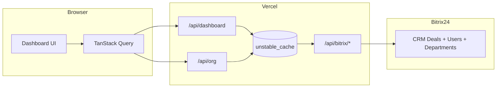

# Dashboard Superintendência Stüpp

Painel operacional em tempo real para acompanhar negociações do **Bitrix24** da Superintendência Stüpp — com visão consolidada, filtros por diretoria/equipe e análise por esteira comercial.

**Produção:** [dashboard-st-pp.vercel.app](https://dashboard-st-pp.vercel.app)

---

## Visão geral

O dashboard conecta-se ao CRM Bitrix24 e apresenta KPIs, funis e evolução temporal das negociações (**deals**) filtradas pela estrutura organizacional da Stüpp. Os dados são segmentados por responsável (`ASSIGNED_BY_ID`), mapeado automaticamente a partir dos departamentos do Bitrix.

### Esteiras comerciais

| Esteira | Category ID (Bitrix) | Rota |
|---------|----------------------|------|
| Comercial Geral | `16` | `/esteira-geral` |
| Comercial Econômico | `64` | `/esteira-economico` |
| Visão consolidada | Ambas | `/` |

### Estrutura organizacional

```
SUPERINTENDÊNCIA STÜPP (ID 3)
└── COMERCIAL-S (ID 60)
    ├── SANTOS
    ├── MONTEIRO
    ├── GEORGII
    ├── TALMON
    ├── STÜPP
    ├── HENRIQUE
    └── SEVERO
        └── Equipes e sub-equipes (Líderes / LT)
```

Cada diretoria agrupa equipes com seus respectivos usuários ativos. O filtro por diretoria ou equipe reduz o volume de dados buscados diretamente na API do Bitrix.

---

## Funcionalidades

- **Visão geral comercial** — KPIs, funis das duas esteiras, evolução temporal e leads por fase
- **Leads por equipe** — seletor com resumo por diretoria ou detalhe por equipe (fases + evolução)
- **Filtros avançados** — período, esteira, diretoria e equipe com botão **Aplicar filtros**
- **Gráficos interativos** — tooltips no hover, sem poluição visual com números fixos nas barras
- **Cache inteligente** — estrutura org e labels de fase em cache de 24h; dados do dashboard em cache de 5 min
- **API única no servidor** — uma requisição do navegador em vez de dezenas de chamadas ao Bitrix
- **UI moderna** — sidebar com logo Stüpp, tipografia Plus Jakarta Sans, paleta azul institucional

---

## Stack tecnológica

| Camada | Tecnologia |
|--------|------------|
| Framework | [Next.js 16](https://nextjs.org/) (App Router + Turbopack) |
| UI | [React 19](https://react.dev/) + [Tailwind CSS v4](https://tailwindcss.com/) |
| Estado | [Zustand](https://zustand.docs.pmnd.rs/) (filtros) |
| Dados | [TanStack Query v5](https://tanstack.com/query) |
| Gráficos | [Recharts](https://recharts.org/) + [ApexCharts](https://apexcharts.com/) |
| Datas | [date-fns](https://date-fns.org/) |
| Deploy | [Vercel](https://vercel.com/) |
| CRM | [Bitrix24 REST API](https://apidocs.bitrix24.com/) |

---

## Arquitetura



### Fluxo de dados

1. O cliente chama `/api/dashboard` com os filtros aplicados.
2. O servidor carrega a estrutura org e labels de fase do cache (quando disponível).
3. Negociações e contagens são buscadas em paralelo no Bitrix, com filtro de `ASSIGNED_BY_ID` quando diretoria/equipe estão selecionadas.
4. Os dados são agregados no servidor e retornados como JSON pronto para os gráficos.

---

## Estrutura do projeto

```
src/
├── app/
│   ├── api/
│   │   ├── bitrix/[...path]/   # Proxy seguro para o webhook Bitrix
│   │   ├── dashboard/          # Endpoint agregado do dashboard
│   │   └── org/                # Estrutura organizacional (filtros)
│   ├── esteira-geral/
│   ├── esteira-economico/
│   ├── layout.tsx
│   └── providers.tsx
├── api/
│   ├── bitrix.ts               # Cliente Bitrix (deals, stages, counts)
│   ├── bitrixConfig.ts         # IDs das esteiras
│   └── bitrixDepartments.ts    # Árvore de departamentos Stüpp
├── components/
│   ├── charts/                 # Gráficos (funil, fases, evolução, equipes)
│   ├── filters/                # Filtros + botão Aplicar
│   ├── layout/                 # Sidebar, Header, DashboardLayout
│   └── ui/                     # PageShell, FilterPanel, KPICard...
├── hooks/
│   ├── useLeadsData.ts
│   └── useStuppOrg.ts
├── lib/
│   ├── orgPreview.ts
│   └── server/                 # Cache, buildDashboardData, webhook
├── screens/                    # Páginas (Dashboard, Esteiras)
├── store/filterStore.ts        # Filtros rascunho vs aplicados
└── utils/aggregateLeads.ts     # Agregação dos dados
```

---

## Pré-requisitos

- **Node.js** 20+
- **npm** 9+
- Webhook de entrada do **Bitrix24** com permissões para:
  - `crm.deal.list`
  - `crm.status.list`
  - `department.get`
  - `user.get`

---

## Configuração local

### 1. Clonar e instalar

```bash
git clone https://github.com/RafaelADSdev/Dashboard-St-pp.git
cd Dashboard-St-pp
npm install
```

### 2. Variáveis de ambiente

Crie um arquivo `.env.local` na raiz do projeto:

```env
# Obrigatório — webhook de entrada do Bitrix24 (nunca commitar)
BITRIX_WEBHOOK_URL=https://seu-portal.bitrix24.com.br/rest/USER_ID/TOKEN/

# IDs das esteiras no CRM (padrão: 16 e 64)
NEXT_PUBLIC_BITRIX_ESTEIRA_GERAL_ID=16
NEXT_PUBLIC_BITRIX_ESTEIRA_ECONOMICO_ID=64
```

> **Compatibilidade:** o projeto também aceita `VITE_BITRIX_WEBHOOK_URL` e `VITE_BITRIX_ESTEIRA_*` para ambientes legados.

### 3. Rodar em desenvolvimento

```bash
npm run dev
```

Acesse [http://localhost:3000](http://localhost:3000).

### 4. Build de produção local

```bash
npm run build
npm start
```

---

## Deploy na Vercel

O projeto está configurado para deploy automático via GitHub.

1. Conecte o repositório à [Vercel](https://vercel.com/)
2. Configure as variáveis de ambiente em **Settings → Environment Variables**:

| Variável | Ambiente | Sensível |
|----------|----------|----------|
| `BITRIX_WEBHOOK_URL` | Production + Preview | Sim |
| `NEXT_PUBLIC_BITRIX_ESTEIRA_GERAL_ID` | Production + Preview | Não |
| `NEXT_PUBLIC_BITRIX_ESTEIRA_ECONOMICO_ID` | Production + Preview | Não |

3. Deploy manual (opcional):

```bash
npx vercel --prod
```

---

## API interna

### `GET /api/org`

Retorna a estrutura organizacional da Stüpp (diretorias, equipes, líderes) para popular os filtros.

- Cache: **24 horas**

### `GET /api/dashboard`

Parâmetros de query:

| Parâmetro | Tipo | Descrição |
|-----------|------|-----------|
| `dateFrom` | `YYYY-MM-DD` | Data inicial (obrigatório) |
| `dateTo` | `YYYY-MM-DD` | Data final (obrigatório) |
| `esteira` | `TODAS \| GERAL \| ECONOMICO` | Filtro de esteira |
| `diretoria` | string | ID da diretoria (vazio = todas) |
| `equipe` | string | ID da equipe (vazio = todas) |

Exemplo:

```
GET /api/dashboard?dateFrom=2026-06-01&dateTo=2026-06-26&esteira=TODAS&diretoria=&equipe=
```

- Cache: **10 segundos** (por combinação de filtros)

### `POST/GET /api/bitrix/*`

Proxy interno para o webhook Bitrix. Usado pelo servidor; o webhook **nunca** é exposto ao navegador.

---

## Filtros

Os filtros funcionam em modo **rascunho → aplicar**:

1. Ajuste período, esteira, diretoria e/ou equipe
2. Clique em **Aplicar filtros** (botão fica azul quando há alterações pendentes)
3. Os dados são recarregados com a combinação selecionada

Na primeira visita, o período padrão (**últimos 7 dias**) já é aplicado automaticamente.

---

## Performance

| Otimização | Detalhe |
|------------|---------|
| API única | Uma requisição HTTP do cliente por carregamento |
| Cache de org | Departamentos + usuários cacheados por 24h |
| Cache de fases | Labels do funil cacheados por 24h |
| Cache de dashboard | Resposta agregada cacheada por **10 segundos** |
| Filtro no Bitrix | `ASSIGNED_BY_ID` enviado na query quando há filtro de diretoria/equipe |
| Prefetch | Estrutura org carregada em background ao abrir o app |
| `keepPreviousData` | Dados anteriores visíveis enquanto novos filtros carregam |
| Atualização automática | Dados do dashboard recarregados a cada **10 segundos** |

---

## Scripts disponíveis

```bash
npm run dev        # Servidor de desenvolvimento (porta 3000)
npm run build      # Build de produção
npm start          # Servidor de produção
npm run typecheck  # Verificação TypeScript
```

---

## Repositório e links

| Recurso | URL |
|---------|-----|
| Repositório | [github.com/RafaelADSdev/Dashboard-St-pp](https://github.com/RafaelADSdev/Dashboard-St-pp) |
| Produção | [dashboard-st-pp.vercel.app](https://dashboard-st-pp.vercel.app) |

---

## Segurança

- O webhook do Bitrix fica **apenas no servidor** (`BITRIX_WEBHOOK_URL`)
- Arquivos `.env` estão no `.gitignore` — nunca commite credenciais
- O proxy `/api/bitrix` evita exposição do token no bundle do cliente

---

## Licença

Projeto privado — uso interno da Superintendência Stüpp.
