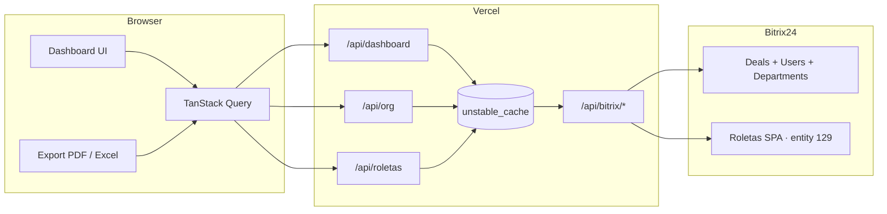

# Dashboard Superintendência Stüpp

Painel operacional para acompanhar negociações do **Bitrix24** da Superintendência Stüpp — com visão consolidada, filtros por diretoria/equipe/roleta, análise por esteira comercial e exportação de relatórios.

**Produção:** [dashboard-st-pp.vercel.app](https://dashboard-st-pp.vercel.app)  
**Repositório:** [github.com/RafaelADSdev/Dashboard-St-pp](https://github.com/RafaelADSdev/Dashboard-St-pp)

---

## Sumário

- [Visão geral](#visão-geral)
- [Funcionalidades](#funcionalidades)
- [Stack tecnológica](#stack-tecnológica)
- [Arquitetura](#arquitetura)
- [Estrutura do projeto](#estrutura-do-projeto)
- [Configuração local](#configuração-local)
- [Deploy na Vercel](#deploy-na-vercel)
- [API interna](#api-interna)
- [Filtros](#filtros)
- [Exportação de relatórios](#exportação-de-relatórios)
- [Performance e confiabilidade](#performance-e-confiabilidade)
- [Segurança](#segurança)
- [Scripts disponíveis](#scripts-disponíveis)

---

## Visão geral

O dashboard conecta-se ao CRM Bitrix24 e apresenta KPIs, funis, evolução temporal e distribuição de leads a partir de **negociações (deals)**. Os dados são segmentados por responsável (`ASSIGNED_BY_ID`), mapeado automaticamente a partir da estrutura de departamentos da Stüpp.

### Esteiras comerciais

| Esteira | Category ID (Bitrix) | Rota |
|---------|----------------------|------|
| Comercial Geral | `16` | `/esteira-geral` |
| Comercial Econômico | `64` | `/esteira-economico` |
| Visão consolidada | Ambas | `/` |

### Estrutura organizacional

```
SUPERINTENDÊNCIA STÜPP (ID 3)
└── COMERCIAL-S (ID 60)
    ├── SANTOS
    ├── MONTEIRO
    ├── GEORGII
    ├── TALMON
    ├── STÜPP
    ├── HENRIQUE
    └── SEVERO
        └── Equipes e sub-equipes (Líderes / LT)
```

Cada diretoria agrupa equipes com seus respectivos usuários ativos. Filtros de diretoria, equipe e roleta reduzem o volume de dados consultados diretamente na API do Bitrix.

---

## Funcionalidades

### Dashboard e análises

- **Visão geral comercial** — KPIs das duas esteiras, funis, evolução temporal, leads por fase e **leads por fonte** (`SOURCE_ID` do Bitrix)
- **Páginas por esteira** — visão focada em Comercial Geral ou Comercial Econômico
- **Leads por diretoria** — gráfico de barras horizontais por diretoria
- **Funis comerciais** — etapas do pipeline com destaque apenas para fases com volume
- **Gráficos interativos** — tooltips no hover, layout limpo

### Filtros

- **Período** — intervalo de datas customizável (padrão: últimos 7 dias)
- **Esteira** — Todas, Comercial Geral ou Comercial Econômico
- **Diretoria e equipe** — recorte pela estrutura org da Stüpp
- **Roleta** — filtro por roletas Stüpp cadastradas no SPA Bitrix (entity type `129`), excluindo roletas inativas/descartadas
- Modo **rascunho → Aplicar filtros**, com feedback visual durante o carregamento
- Painel de filtros em **drawer lateral**; sidebar recolhível

### Exportação

- Botão **Exportar** no header — PDF ou Excel com os filtros e dados atualmente aplicados
- **Excel estruturado** — aba Resumo (KPIs, filtros, índice), abas por seção com ranking, percentual e linha de total; identidade visual HubON
- **PDF tabular** — relatório completo por seções; linhas com valor `0` são omitidas
- Exportações respeitam a página atual (visão geral ou esteira específica)

### Interface

- Sidebar com logo Stüpp, navegação entre visão geral e esteiras
- Paleta azul institucional, tipografia Plus Jakarta Sans
- Atualização automática dos dados a cada **10 segundos**

---

## Stack tecnológica

| Camada | Tecnologia |
|--------|------------|
| Framework | [Next.js 16](https://nextjs.org/) (App Router + Turbopack) |
| UI | [React 19](https://react.dev/) + [Tailwind CSS v4](https://tailwindcss.com/) |
| Estado | [Zustand](https://zustand.docs.pmnd.rs/) (filtros + layout UI) |
| Dados | [TanStack Query v5](https://tanstack.com/query) |
| Auth | [Supabase Auth](https://supabase.com/docs/guides/auth) + [@supabase/ssr](https://supabase.com/docs/guides/auth/server-side/nextjs) |
| Gráficos | [Recharts](https://recharts.org/) + [ApexCharts](https://apexcharts.com/) |
| Exportação | [jsPDF](https://github.com/parallax/jsPDF) + [jspdf-autotable](https://github.com/simonbengtsson/jsPDF-AutoTable), [xlsx-js-style](https://www.npmjs.com/package/xlsx-js-style) |
| Datas | [date-fns](https://date-fns.org/) |
| Deploy | [Vercel](https://vercel.com/) |
| CRM | [Bitrix24 REST API](https://apidocs.bitrix24.com/) |

---

## Arquitetura



### Fluxo de dados

1. O cliente chama `/api/dashboard` com os filtros aplicados.
2. O servidor carrega do cache: estrutura org, catálogo de fases, labels de fonte e roletas Stüpp.
3. Negociações, contagens por esteira e breakdowns (diretoria/equipe) são buscados em paralelo no Bitrix.
4. Quando o volume ultrapassa 500 registros por consulta, a API aplica **split automático** por esteira e por intervalo de datas.
5. Os dados são agregados no servidor (`aggregateLeadsData`) e retornados como JSON pronto para os gráficos e exportações.

---

## Estrutura do projeto

```
src/
├── app/
│   ├── api/
│   │   ├── bitrix/[...path]/   # Proxy seguro para o webhook Bitrix
│   │   ├── dashboard/          # Endpoint agregado do dashboard
│   │   ├── org/                # Estrutura organizacional
│   │   └── roletas/            # Roletas Stüpp (SPA entity 129)
│   ├── esteira-geral/
│   ├── esteira-economico/
│   └── providers.tsx
├── api/
│   ├── bitrix.ts               # Cliente Bitrix (deals, stages, counts, fontes)
│   ├── bitrixRoletas.ts        # Roletas Stüpp + campo UF_CRM_1734703374
│   ├── bitrixConfig.ts         # IDs das esteiras
│   ├── bitrixDepartments.ts    # Árvore de departamentos Stüpp
│   └── bitrixStages.ts           # Catálogo de fases do funil
├── components/
│   ├── charts/                 # Funil, fases, evolução, diretoria, origem
│   ├── filters/                # Filtros + botão Aplicar + RoletaFilter
│   ├── layout/                 # Sidebar, Header, ExportButton
│   └── ui/                     # FilterPanel (drawer), KPICard, ChartCard...
├── hooks/
│   ├── useLeadsData.ts
│   ├── useStuppOrg.ts
│   └── useStuppRoletas.ts
├── lib/server/                 # Cache, buildDashboardData, webhook
├── screens/                    # DashboardPage, EsteiraGeral, EsteiraEconomico
├── store/
│   ├── filterStore.ts          # Filtros rascunho vs aplicados
│   └── layoutUiStore.ts        # Sidebar / drawer de filtros
└── utils/
    ├── aggregateLeads.ts       # Agregação dos dados
    ├── exportDashboard.ts      # Contexto e seções de exportação
    └── excel/                  # Layout Excel estruturado
lib/supabase/                   # Cliente browser, server e middleware Auth
```

---

## Configuração local

### Pré-requisitos

- **Node.js** 20+
- **npm** 9+
- Webhook de entrada do **Bitrix24** com permissões para:
  - `crm.deal.list`
  - `crm.status.list`
  - `crm.dealcategory.stage.list`
  - `crm.item.list` (roletas SPA)
  - `department.get`
  - `user.get`

### 1. Clonar e instalar

```bash
git clone https://github.com/RafaelADSdev/Dashboard-St-pp.git
cd Dashboard-St-pp
npm install
```

### 2. Variáveis de ambiente

Crie um arquivo `.env.local` na raiz do projeto:

```env
# Obrigatório — webhook de entrada do Bitrix24 (nunca commitar)
BITRIX_WEBHOOK_URL=https://seu-portal.bitrix24.com.br/rest/USER_ID/TOKEN/

# IDs das esteiras no CRM (padrão: 16 e 64)
NEXT_PUBLIC_BITRIX_ESTEIRA_GERAL_ID=16
NEXT_PUBLIC_BITRIX_ESTEIRA_ECONOMICO_ID=64

# Supabase Auth (obrigatório em produção)
# Projeto: https://supabase.com/dashboard/project/vhtztzilrrlbflicmeft
NEXT_PUBLIC_SUPABASE_URL=https://vhtztzilrrlbflicmeft.supabase.co
NEXT_PUBLIC_SUPABASE_ANON_KEY=sua_chave_anon
```

> Crie usuários com `npm run seed:admin` (requer `SUPABASE_SERVICE_ROLE_KEY`) ou manualmente no painel Supabase.  
> Login por **nome de usuário** — o sistema converte internamente para `usuario@stupp.dashboard`.  
> Admin inicial: usuário `admin` / senha `admin123`.

> **Compatibilidade:** o projeto também aceita `VITE_BITRIX_WEBHOOK_URL` e `VITE_BITRIX_ESTEIRA_*` para ambientes legados.

### 3. Rodar em desenvolvimento

```bash
npm run dev
```

Acesse [http://localhost:3000](http://localhost:3000).

### 4. Build de produção local

```bash
npm run build
npm start
```

---

## Deploy na Vercel

O projeto está configurado para deploy automático via GitHub.

1. Conecte o repositório à [Vercel](https://vercel.com/)
2. Configure as variáveis de ambiente em **Settings → Environment Variables**:

| Variável | Ambiente | Sensível |
|----------|----------|----------|
| `BITRIX_WEBHOOK_URL` | Production + Preview | Sim |
| `NEXT_PUBLIC_BITRIX_ESTEIRA_GERAL_ID` | Production + Preview | Não |
| `NEXT_PUBLIC_BITRIX_ESTEIRA_ECONOMICO_ID` | Production + Preview | Não |
| `NEXT_PUBLIC_SUPABASE_URL` | Production + Preview | Não |
| `NEXT_PUBLIC_SUPABASE_ANON_KEY` | Production + Preview | Não |

3. Deploy manual (opcional):

```bash
npx vercel --prod
```

---

## API interna

### `GET /api/org`

Retorna a estrutura organizacional da Stüpp (diretorias, equipes, líderes) para popular os filtros.

- Cache: **24 horas**

### `GET /api/roletas`

Retorna as roletas Stüpp ativas filtradas do SPA Bitrix (entity type `129`).

- Cache: **24 horas**
- Exclui roletas marcadas como inativas, descartadas ou de teste

### `GET /api/dashboard`

Parâmetros de query:

| Parâmetro | Tipo | Descrição |
|-----------|------|-----------|
| `dateFrom` | `YYYY-MM-DD` | Data inicial (obrigatório) |
| `dateTo` | `YYYY-MM-DD` | Data final (obrigatório) |
| `esteira` | `TODAS \| GERAL \| ECONOMICO` | Filtro de esteira |
| `diretoria` | string | ID da diretoria (vazio = todas) |
| `equipe` | string | ID da equipe (vazio = todas) |
| `roleta` | string | ID da roleta (vazio = todas) |

Exemplo:

```
GET /api/dashboard?dateFrom=2026-06-01&dateTo=2026-06-26&esteira=TODAS&diretoria=&equipe=&roleta=
```

Resposta inclui, entre outros campos:

| Campo | Descrição |
|-------|-----------|
| `totalLeads`, `geralCount`, `economicoCount` | KPIs |
| `byDiretoria`, `byTeam` | Distribuição organizacional |
| `byStage`, `bySource` | Fases do funil e fontes (`SOURCE_ID`) |
| `funnelGeral`, `funnelEconomico` | Funis por esteira |
| `overTime` | Evolução diária |

- Cache: **10 segundos** (por combinação de filtros)

### `POST/GET /api/bitrix/*`

Proxy interno para o webhook Bitrix. Usado pelo servidor; o webhook **nunca** é exposto ao navegador.

---

## Filtros

Os filtros funcionam em modo **rascunho → aplicar**:

1. Abra o painel de filtros pelo botão no header
2. Ajuste período, esteira, diretoria, equipe e/ou roleta
3. Clique em **Aplicar filtros** (botão fica azul quando há alterações pendentes)
4. Os dados são recarregados com a combinação selecionada

Na primeira visita, o período padrão (**últimos 7 dias**) já é aplicado automaticamente.

---

## Exportação de relatórios

O botão **Exportar** (header) gera relatórios com base nos **filtros aplicados** e na **página atual**.

| Formato | Conteúdo |
|---------|----------|
| **Excel (.xlsx)** | Aba Resumo + abas por seção (diretoria, equipe, fase, origem, funil, evolução) com ranking, `% do total`, totais e formatação HubON |
| **PDF** | Relatório tabular por seções, com filtros aplicados no topo |

Regras comuns:

- Linhas com valor **0** são omitidas
- Nome do arquivo: `dashboard-stupp-{pagina}-{data}.xlsx` / `.pdf`
- A origem dos leads usa o campo **Fonte** do Bitrix (`SOURCE_ID`)

---

## Performance e confiabilidade

| Otimização | Detalhe |
|------------|---------|
| API única | Uma requisição HTTP do cliente por carregamento |
| Cache de org / fases / fontes / roletas | Cacheados por **24 horas** |
| Cache de dashboard | Resposta agregada cacheada por **10 segundos** |
| Filtro no Bitrix | `ASSIGNED_BY_ID` e roleta enviados na query quando aplicável |
| Limite de 500 registros | Split por esteira e por datas; contagens via `countDeals` para breakdowns |
| Prefetch | Estrutura org e roletas carregadas em background |
| `placeholderData` | Dados anteriores visíveis enquanto novos filtros carregam |
| Atualização automática | Dados recarregados a cada **10 segundos** |
| Retry Bitrix | Requisições repetidas em caso de rate limit ou timeout |

---

## Segurança

- **Login via Supabase Auth** — usuários individuais com e-mail e senha
- Sessão em cookies gerenciada pelo `@supabase/ssr` (renovação automática no middleware)
- Rotas `/api/*` e páginas do dashboard protegidas por middleware (`getClaims`)
- O webhook do Bitrix fica **apenas no servidor** (`BITRIX_WEBHOOK_URL`)
- Arquivos `.env` estão no `.gitignore` — nunca commite credenciais
- O proxy `/api/bitrix` evita exposição do token no bundle do cliente
- **Nunca** exponha a `service_role` key do Supabase no frontend

---

## Scripts disponíveis

```bash
npm run dev        # Servidor de desenvolvimento (porta 3000)
npm run build      # Build de produção
npm start          # Servidor de produção
npm run typecheck  # Verificação TypeScript
```

---

## Licença

Projeto privado — uso interno da Superintendência Stüpp / HubON.
